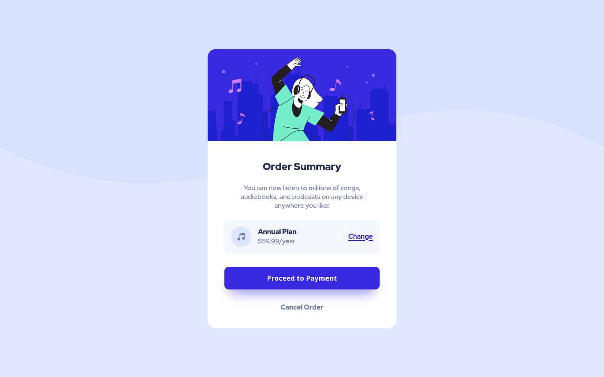

# Frontend Mentor - Order summary card solution

This is a solution to the [Order summary card challenge on Frontend Mentor](https://www.frontendmentor.io/challenges/order-summary-component-QlPmajDUj). Frontend Mentor challenges help you improve your coding skills by building realistic projects. 

## Table of contents

- [Frontend Mentor - Order summary card solution](#frontend-mentor---order-summary-card-solution)
  - [Table of contents](#table-of-contents)
  - [Overview](#overview)
    - [The challenge](#the-challenge)
    - [Screenshot](#screenshot)
    - [Links](#links)
  - [My process](#my-process)
    - [Built with](#built-with)
    - [What I learned](#what-i-learned)
    - [Continued development](#continued-development)
    - [Useful resources](#useful-resources)
  - [Author](#author)

## Overview

### The challenge

Users should be able to:

- See hover states for interactive elements

### Screenshot


### Links

- Solution URL: [github.com/nadimalid/order-summary-component-main](https://github.com/nadimalid/order-summary-component-main)
- Live Site URL: [nadimalid.github.io/order-summary-component-main/](https://nadimalid.github.io/order-summary-component-main/)

## My process

### Built with

- Semantic HTML5 markup
- CSS custom properties
- Flexbox

### What I learned

Breakpoints could be set differently for each project as required, and different CSS frameworks use different breakpoints

```css
### Common Media Query breakpoints:
| Breakpoint | Description |
| -------- | ---------- |
| < 481px | Mobile devices |
| 481px — 768px | iPads, Tablets |
| 769px — 1024px | Small screens, laptops |
| 1025px — 1200px | Desktops, large screens |
| 1201px and greater | Extra large screens, TV |
```

### Continued development

- Improve resposive design for different breakpoints

### Useful resources

- [youtube tutorial](https://www.youtube.com/watch?v=69IbzTWg5PM&t=484s&ab_channel=DaveGray) - This helped me understand resposive design and breakpoints better, it will help gain basic knowledge of resposive design and different breakpoints used by other CSS frameworks. 

## Author

- Frontend Mentor - [@nadimalid](https://www.frontendmentor.io/profile/nadimalid)
